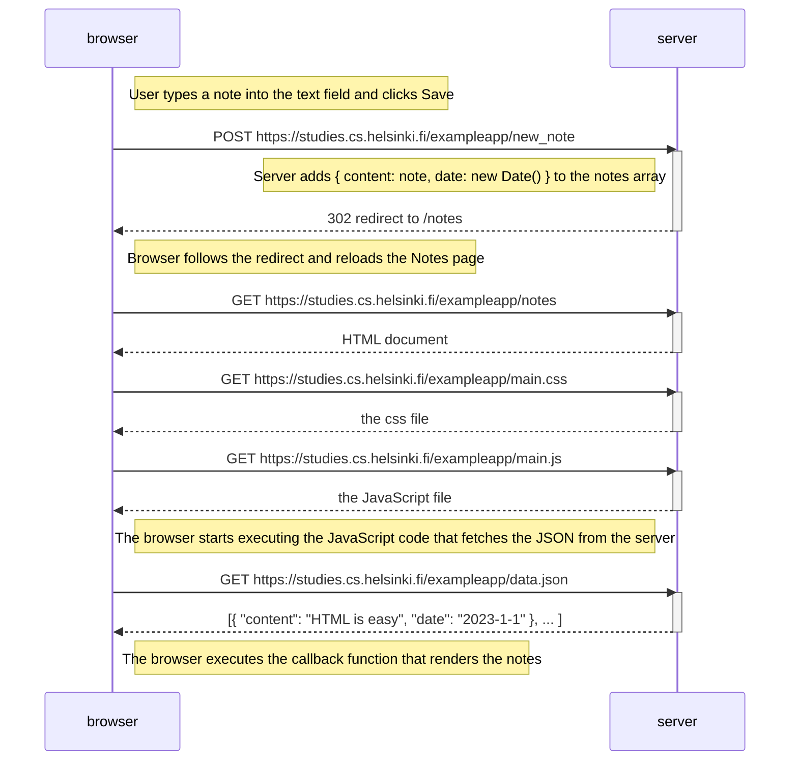

# 0.4: New note

Diagram depicting the situation where the user creates a new note on the page
<https://studies.cs.helsinki.fi/exampleapp/notes> by writing something into the
text field and clicking the *Save* button.

Submitting the form sends an HTTP POST request to the address `new_note`. The
server responds with status code 302 (URL redirect) asking the browser to do a
new HTTP GET request to `notes`, which reloads the Notes page and triggers the
same chain of requests as loading the page (HTML, CSS, JS, and the JSON data).

