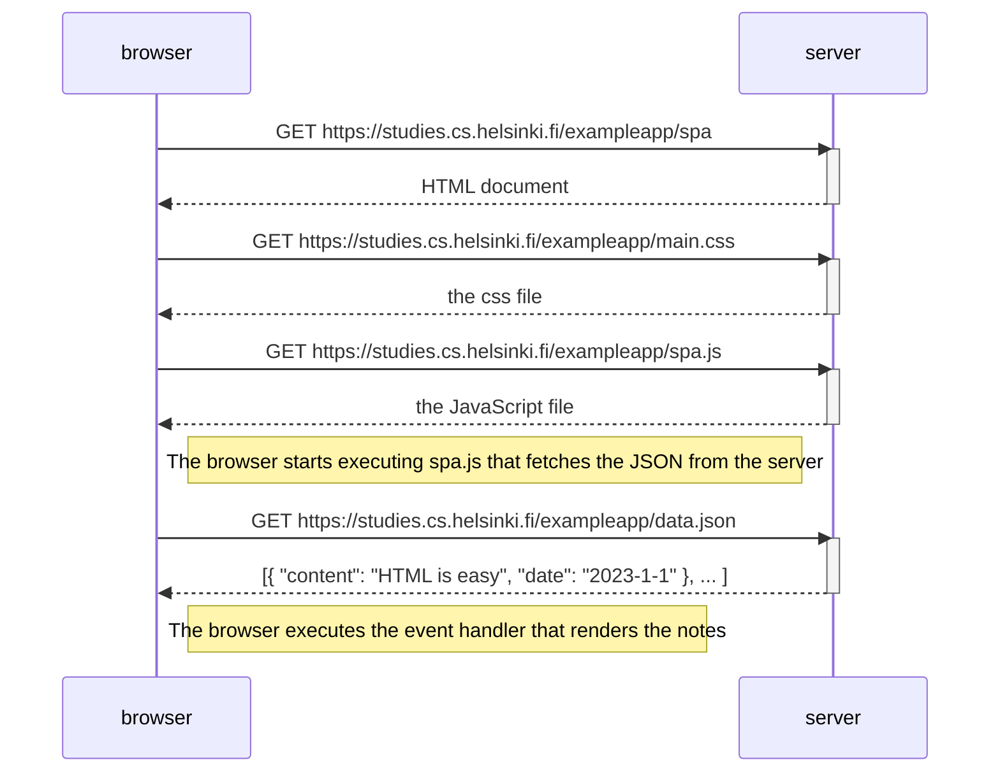

# 0.5: Single page app

Diagram depicting the situation where the user goes to the single page app
version of the notes app at <https://studies.cs.helsinki.fi/exampleapp/spa>.

The HTML is almost identical to the traditional version, but the JavaScript file
is `spa.js` instead of `main.js`. The page is loaded only once; afterwards the
content is manipulated in the browser with JavaScript.

