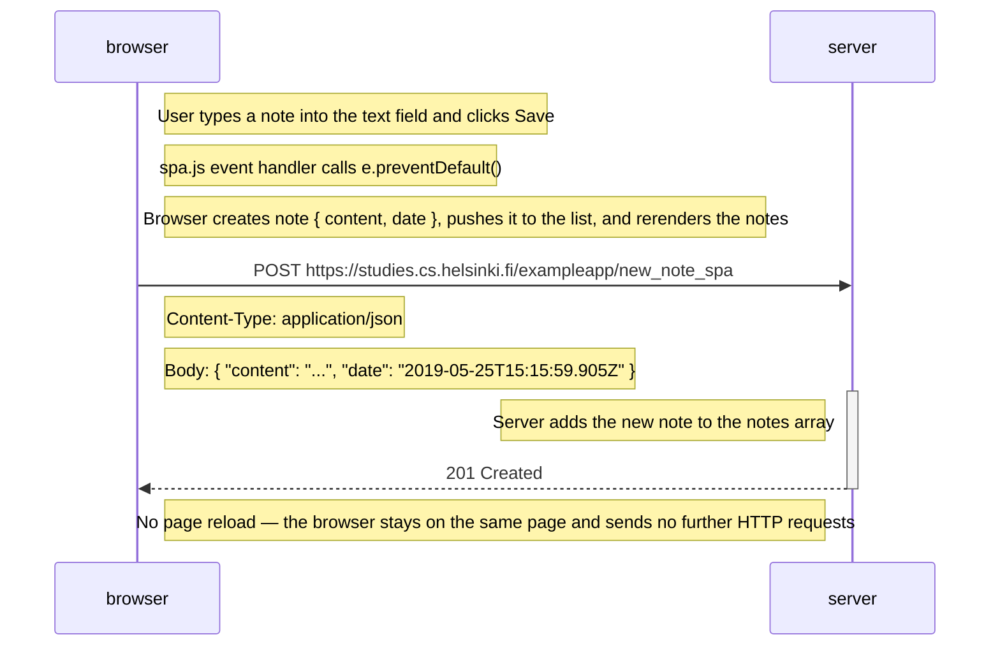

# 0.6: New note in single page app

Diagram depicting the situation where the user creates a new note using the
single page version of the app at
<https://studies.cs.helsinki.fi/exampleapp/spa>.

The form has no `action` or `method` attributes. The `spa.js` event handler
calls `e.preventDefault()` so the browser does not reload the page. It creates a
new note object, rerenders the notes list immediately, and sends the note as JSON
to the server with an HTTP POST request to `new_note_spa`. The server responds
with status code 201 created and asks for no redirect, so the browser stays on
the same page and sends no further HTTP requests.

